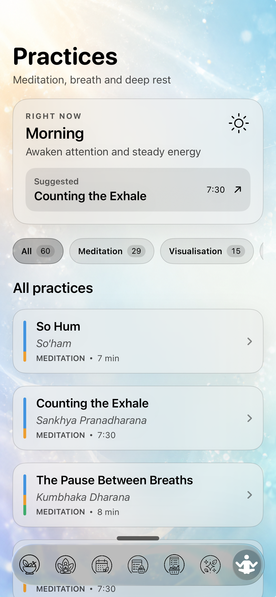
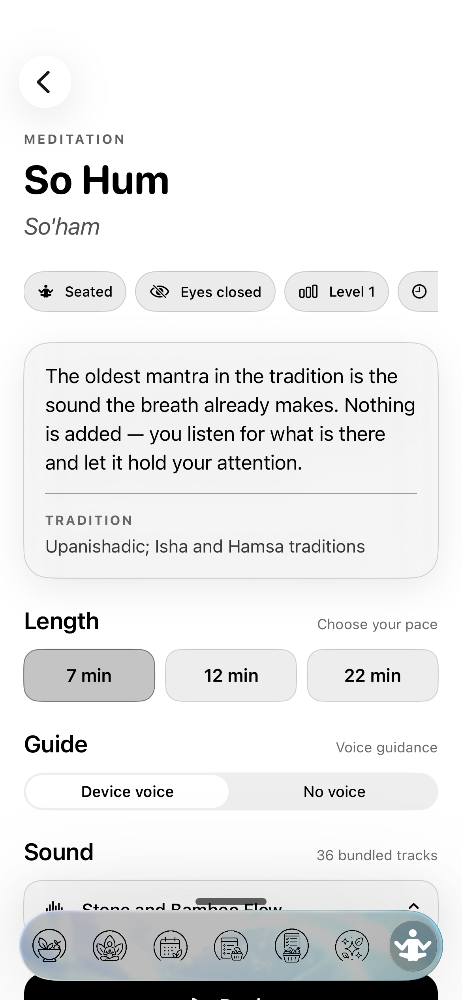
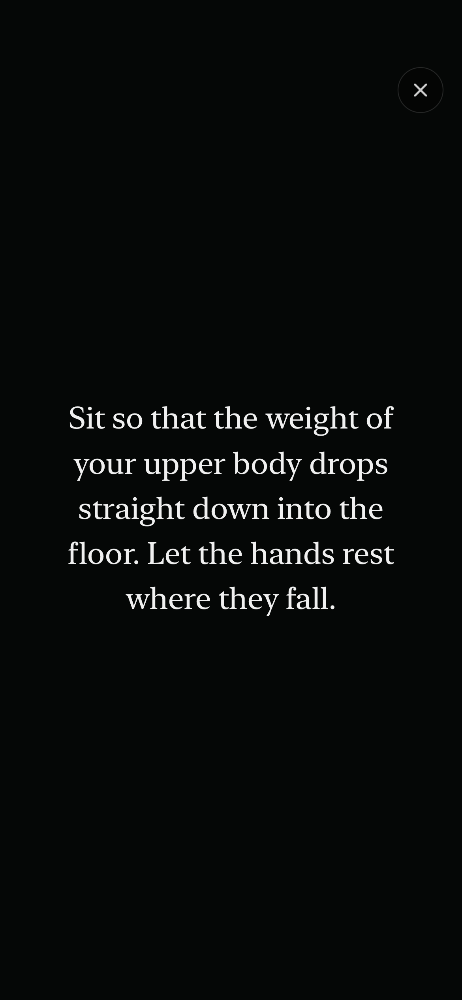

# Practices implementation report

## Completion

- Functional implementation: **100%** for the assets that were supplied.
- Whole brief including scene artwork still not supplied: **97%**.
- Clean simulator build: **passed** with Xcode 26.1.1.
- Bundle verification: **passed** for 60 narration folders, 601 recorded cues,
  the production manifest, and all 36 ambience tracks.

The remaining 3% is final scene artwork. Recorded narration now uses the
delivered production cues and their measured durations. Authored cue start
times remain active, and an intentionally restrained gradient scene fallback
is used where no scene artwork is present.

## App tab and navigation

`AppTab.practices` was appended after `nodes`; no existing raw value moved. A
twelfth stable ID was appended and the runtime now preconditions that
`stableIDs.count == AppTab.allCases.count`.

The repository contains the canonical UUIDv5 namespace in
`ayurveda-data/stable_ids.py`:

- root namespace: `uuid5(NAMESPACE_URL, "https://ayura.app/seed-identities/v1")`
- exact new input: `app-tab:practices`
- resulting UUID: `F4728EEB-7771-57B2-8B06-48CA4A4A654C`

The older `AppTab` IDs cannot be reproduced from the current generator and no
older AppTab derivation script exists in the repository history. The new value
therefore follows the repository's documented canonical namespace without
changing any shipped ID.

The tab is wired through `RootView.tabContent` and uses the existing liquid tab
bar. Its visible position is immediately after Training and before Calendar.
The former Training lotus/meditation asset is now the Practices template icon.
Training has a newly generated monoline Tree Pose (`Vrksasana`) figure based on
the supplied visual reference, retaining the same open circular frame and
transparent template treatment as the rest of the tab icon set.
Practices participates in the same global search flow as Food List. Search
matches titles, Sanskrit names, descriptions, kinds, techniques, traditions,
metadata, themes, goals, contraindications, and cue text, and combines with the
local kind filters. Search visibility is centralized in
`selectedTabAllowsGlobalSearch`; 16 editor-dismiss reset sites use it.

Favorites follow the existing Food and Exercise convention: a yellow star is
available on both library rows and the entry card, the value persists in
SwiftData, and a counted Favorites chip combines with global search. Favorite
IDs are preserved if a future seed version refreshes the practice catalogue.

## Data and seeding

The original `practices.json` was copied byte-for-byte. Its SHA-256 is
`9b31d68fd65c7d6df1746889a38540c9316681e16deac4b847cd2c0fbe42e2db` in
both the handoff and the bundled copy.

`Practice` and `PracticeCue` are SwiftData models and are part of the main
schema. `PracticeSeeder` runs immediately after `YogaSeeder` and validates the
catalog before inserting it.

- Practices: **60**
- Cues: **601**
- Validation failures: **0**
- Unresolved `seatAsanaId` references: **0**
- `supersedesAsanaSlug` rows modified: **0**
- Timing mode: **authored**

Validation covers positive total duration, ambience volume in `0...1`, sorted
cue times, cue bounds, non-empty text, non-negative holds, unique IDs/slugs/
catalog numbers, exact catalogue range, and yoga seat references. The seeder
also supports a future `practice_timing_manifest.json`; if bundled, it switches
to measured timing after verifying cue counts.

## Screens

### Library

Includes the time-aware Right now recommendation, counted filters, all 60 rows,
and Exercise List-style cards with an 80-point circular kind thumbnail and a
segmented vata/pitta/kapha pacification ring.

### Entry card

Includes metadata, tradition, contraindications before length whenever present,
runtime-safe duration options, recorded/no-voice guidance, all 36 bundled
sounds, and Begin.

### Player

The player shows one centred cue, fades to darkness for holds, has no clock or
progress UI, gives one haptic per cue, supports tap-anywhere advance, and leaves
the close button as the only small target. Visualisations receive a scene layer
that fades to 7%; meditations have no scene layer.

## Audio

All **36 MP3 files** from `meditaions music` were copied into
`Ayura/Practices/Ambience`. Xcode currently flattens synchronized resource
folders in the product bundle, so the resolver supports both the intended
`Practices/Ambience` path and the product root. Bundle verification found all
36 tracks.

Every sound is available in the entry picker and every sound is also assigned
as the automatic default of at least one practice. The 36 resources are grouped
under the 12 logical ambience IDs and rotate deterministically by catalogue
order. The seed gate verifies that there are 36 unique mappings, that all are
assigned across the 60 practices, and that every mapped bundle URL resolves.

The source and bundled directories both contain 36 MP3 files (133 MB), with no
filename differences and no SHA-256 differences.

The Maya1 delivery contributes **601 production cues** for all **60 practices**.
The repository copies are MP3 (mono, 24 kHz, 96 kbps, 58.91 MiB), encoded from
the delivered 24 kHz, 16-bit PCM WAV masters. This saves 174.41 MiB (74.75%);
the original lossless delivery remains outside the repository as a backup.
The source assets live in `Resources/PracticeNarration`; an explicit Xcode file
list and sandboxed copy phase preserve the required
`narration/audio/<practice-slug>/cue-XX.mp3` hierarchy in the product bundle.

Recorded guidance is now the default and Apple device TTS is no longer part of
the Practices player. Every cue is selected through the production manifest at
its authored start time; its measured audio duration controls the visual
transition into the hold. The entry screen offers `Guided voice` and `No voice`.

The practice seed version is 2 and validates 60 manifest practices, 601
manifest cues, complete consecutive cue indices, and resolvable bundle files.
The delivered `practices.json` and `voices.json` match the existing bundled
copies byte-for-byte, so they were not duplicated.

No new individual file exceeds 90 MB and no commit was created.
