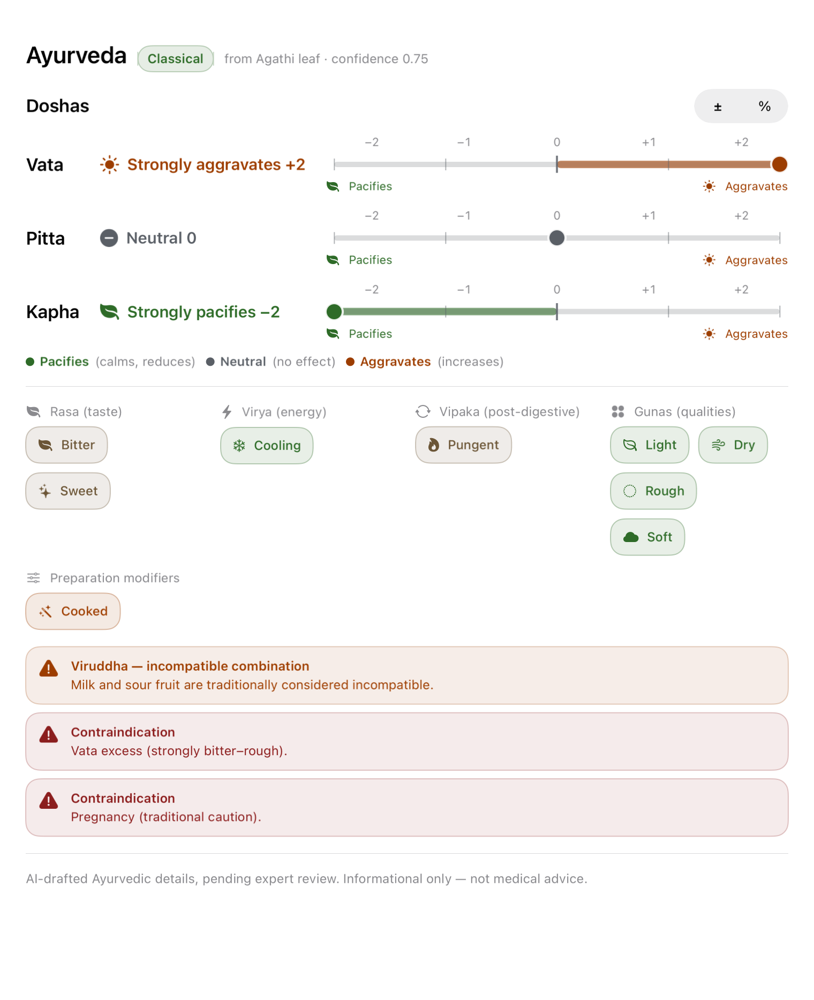
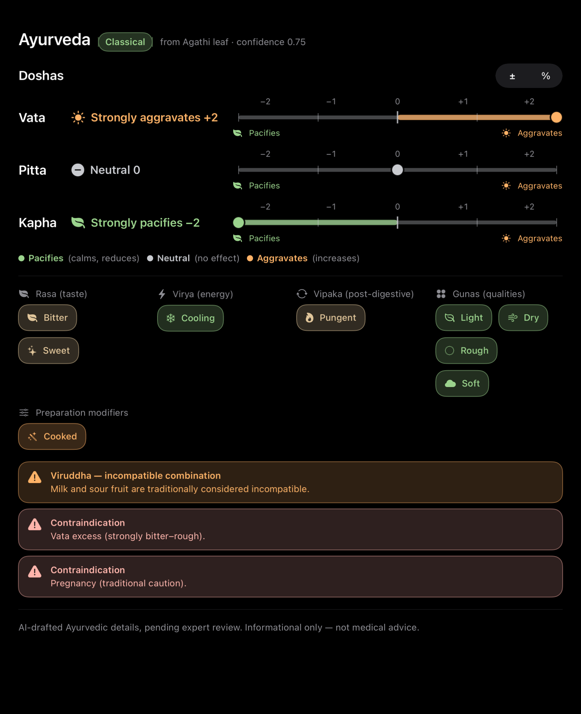
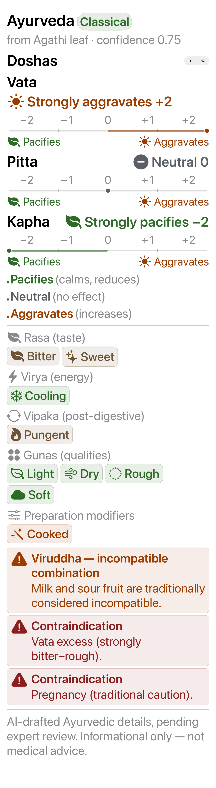
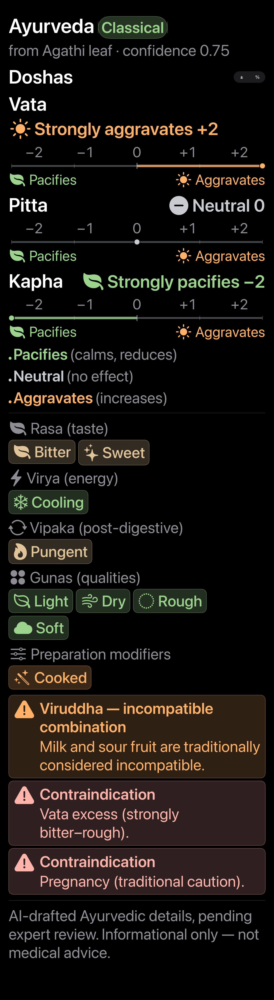

# REPORT WE-3 — Ayurveda display card redesign

Date: 2026-07-24
Branch: `ayurveda-app`
Status: **COMPLETE — all local gates green**

## Summary

WE-3 implements the founder-approved warm, earthy “option A” card for the
read-only Ayurveda display. It is a visual and accessibility change only:
resolver precedence, stored values, lifecycle, claims boundaries, display-mode
behavior, and editor behavior are unchanged.

The card now provides:

- signed dosha effects as primary words and values, with redundant glyph,
  color, axis, dot, and center-to-value fill;
- a wrapping plain-language legend;
- glyph-bearing Rasa, Virya, Vipaka, and Guna chips;
- always-visible warning rows for viruddha and contraindications; and
- the existing AI-draft disclaimer as secondary text outside warning surfaces.

The existing D8.3 design language is reused. `DoshaScaleSelector` and
`AyurvedaChip` gained read-only initializers while their original interactive
branches remain intact; `ChipGrid` provides wrapping; the existing `± / %`
display picker remains available. No editor source was changed.

## Dosha presentation

The signed values map exactly as follows:

| Value | Primary text | Glyph | Semantic color |
|---:|---|---|---|
| −2 | Strongly pacifies −2 | `leaf.fill` | pacify green |
| −1 | Pacifies −1 | `leaf.fill` | pacify green |
| 0 | Neutral 0 | `minus.circle.fill` | neutral gray |
| +1 | Aggravates +1 | `sun.max.fill` | aggravate amber |
| +2 | Strongly aggravates +2 | `sun.max.fill` | aggravate amber |

Every scale labels all five steps from −2 through +2, distinguishes the center
tick, places a filled dot on the value, and fills from zero to the selected
value. “Pacifies” and “Aggravates” also appear at the axis endpoints, so color
is never the sole carrier.

Each dosha row is exposed as one VoiceOver element. Examples from the tested
mapping are:

```text
Vata: strongly pacifies, minus two of two
Pitta: neutral, zero of two
Kapha: strongly aggravates, plus two of two
```

## Adaptive layout and motion

`ViewThatFits` keeps the effect label and scale aligned at ordinary widths and
stacks the scale below the label when horizontal space is insufficient. The
legend uses the existing flow layout, chips allow multiline text, and the four
property groups switch to a vertical arrangement at accessibility categories.
No WE-3 text uses one-line truncation.

The largest tested Dynamic Type category is
`UIContentSizeCategoryAccessibilityExtraExtraExtraLarge`
(`.accessibility5`). At the same 760-point reference-card width, the rendered
card grows from 1,867 to 5,538 pixels at 2× scale and preserves every label,
warning, and footer line.

The card observes Reduce Motion and disables its display transaction animation
when that preference is active.

## Color tokens and WCAG AA

Five named asset tokens were added with explicit light and dark appearances:
`AyurvedaPacify`, `AyurvedaAggravate`, `AyurvedaNeutral`,
`AyurvedaWarning`, and `AyurvedaChipTint`.

Contrast was calculated from the exact sRGB asset values using WCAG relative
luminance. Ratios below are foreground against the surface on which that text
is rendered:

| Pair | Light | Dark | AA |
|---|---:|---:|---|
| Pacify on system background | 6.46:1 | 12.10:1 | PASS |
| Aggravate on system background | 6.82:1 | 11.82:1 | PASS |
| Neutral on system background | 6.43:1 | 12.94:1 | PASS |
| Warning on system background | 9.12:1 | 12.37:1 | PASS |
| Chip tint on system background | 7.05:1 | 12.62:1 | PASS |
| Pacify on green chip surface | 5.52:1 | 8.18:1 | PASS |
| Aggravate on amber surface | 5.94:1 | 8.87:1 | PASS |
| Warning on red warning surface | 7.80:1 | 9.21:1 | PASS |
| Chip tint on sand chip surface | 5.99:1 | 8.42:1 | PASS |

The minimum measured ratio is **5.52:1**, above the WCAG AA requirement for
normal text.

## Reference screenshots

The four deterministic snapshots use the exact production card, display
mapping, controls, flow layout, and color assets. The harness replaces only the
existing dynamic glass container with a neutral secondary-system background so
the layout baseline is deterministic.

### Light — default type



### Dark — default type



### Light — largest accessibility type



### Dark — largest accessibility type



| Snapshot | Pixels |
|---|---:|
| Light / default | 1,520 × 1,867 |
| Dark / default | 1,520 × 1,867 |
| Light / accessibility5 | 1,520 × 5,538 |
| Dark / accessibility5 | 1,520 × 5,538 |

A clean second render matched every stored baseline exactly: maximum-channel
mean difference `0.000` and RMS difference `0.000` for all four images.

## Local gates

| Gate | Result |
|---|---|
| Final artifact validator + D34 resolver simulation | PASS — 714 dravyas / 1,500 recipes; 12,601/12,601 USDA foods resolved |
| Full repository Python suite | PASS — 12/12 |
| Dosha values −2 / 0 / +2 | PASS — production mapping compiled and asserted |
| D8.3 component reuse / editor isolation | PASS |
| Default + largest-type snapshot suite, light + dark | PASS — 4/4; exact repeat |
| Clean-derived-data iOS simulator build | PASS — `** BUILD SUCCEEDED **` |
| Dynamic Type / no-truncation structure | PASS |
| Reduce Motion handling | PASS |
| WCAG AA | PASS — minimum 5.52:1 |
| Lifecycle | PASS — 714 dravyas, 1,500 recipes, and all 2,214 artifact profiles remain `aiDraft` |
| Claims boundary | PASS — USDA `ZFOODITEM` rows gained no Ayurveda claim columns or content |
| Scope | PASS — production changes are limited to Ayurveda display views and named color assets |

The Xcode project has no test target. The WE-3 regression suite therefore
compiles the production dosha mapping, structurally audits the production
SwiftUI, renders the production display card in a temporary simulator fixture,
and is paired with the clean app build above.

## Follow-up candidates

These are candidates only; none was started:

1. Physical-device VoiceOver smoke for the final spoken cadence and rotor
   behavior.
2. Add compact-iPhone visual baselines if that device class becomes part of the
   project’s standing screenshot matrix.
